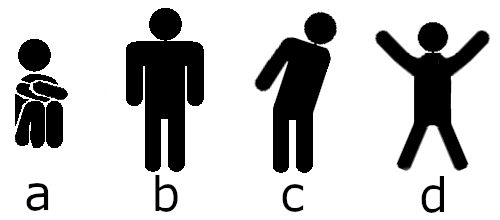

# ESP32_WiFi_Sensing_Game
End-to-end pipeline developed to gather CSI data from an ESP32, train a model, and play a game. The game first gathers
all the required data from the connected ESP32, while presenting what poses to perform to the player.
Afterwards, it trains a CNN model to recognise poses based on the data, before beginning an endless cycle
in which obstacles (walls) move towards the player, and the player has to perform the correct poses to avoid
the obstacles.

The four poses successfully recognized by the model are shown below, though they are only used visually in game.
If a player chose to perform different poses, as long as they remember which performed pose is assigned to which
visual pose, the game will still work correctly, though the accuracy of the model may be significantly lower.

Based on the works of Thuận Tống (https://github.com/thu4n/ESP32-WiFi-Sensing) and Max Rohowsky (https://github.com/MaxRohowsky/chrome-dinosaur).

Tool for collecting CSI: https://github.com/StevenMHernandez/ESP32-CSI-Tool

### Hardware Setup:
- PC and two ESP32
- The ESP32 ESP32-CSI-Tool firmware listed above has to be flashed separately (one ESP32 a AP, the other as STA)
- The two ESP32s were placed 3 meters apart, with the person performing 4 poses in the middle at a roughly 45 degree angle
excluding pose "ski jump" (C), which is turned 90 degrees compared to the other poses
- install all required packages (pip install -r requirements.txt), installing tensorflow separately due to its gpu
dependency
- The project was made in Python 3.12, and tested on a Windows OS. Any deviation has not been tested

# Launching
In order to launch the game, run game.py. It will automatically connect to the COM3 USB device
(change as needed in game.py) in order to extract CSI data from the ESP32, using the tool listed above (ESP32-CSI-Tool). 
After launching the game for the first time and performing the poses as instructed on the screen, the CSI 
data will be saved to four different files: standing.csv, crouching.csv, ski_jump.csv, x_pose.csv. These
files are necessary for further evaluation. Example data is included with the code. 

> WARNING: running the game will overwrite the existing csv files.

# Testing
To test the efficiency of the whole pipeline, simply continue past the initial data collection phase of game.py, after
which the model is trained and the game will begin.
The python console will print CNN model accuracy and then proceed to live testing in which the game is played.
Additional tools have been included in order to further explain the CNN model, like measuring performance and
prediction process:
- accuracy_metrics.py, which saves learning curves, prints overall accuracy results for each class, and
creates a confusion matrix, which is also saved,
- model_optimization.py, showcasing how CNN models were optimized on example data. These models were not
used, as they were found to be worse at generalization,
- model_visualization.py, which visualizes a CNN model saved to a .keras file, 
- SHAP_visualizations.py, which showcases a matrix of CSI amplitude maps with red and blue squares drawn on
them. These squares show which pixels influenced the model prediction both negatively and positively.